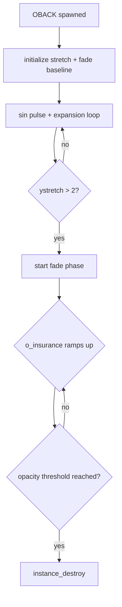

## OBACK_4 - Background Warp Device Analysis

| Variable | Description |
|---|---|
| DEVICE_OBACK_4 | background distortion device (version 4) |
| global.__objectDepths[197] | 750000 (mid-background render layer) |
| OBSPEED | expansion velocity of warp effect |
| siner | internal time accumulator for pulse + animation |
| xstretch / ystretch | radial expansion state |
| o_insurance | fade-out accumulator (post-threshold decay) |
| b_insurance | blend stabilization offset (-0.2 → 0) |

---

## Room / Scene Setup (Create)

```cpp
siner = 0;
alpha = 0.2;
xstretch = 1;
ystretch = 1;

OBSPEED = 0.02;

o_insurance = 0;
b_insurance = -0.2;

depth = 4 + instance_number(object_index);
````

- initializes a neutral background state
    
- sets minimal opacity baseline
    
- assigns stacking depth per instance
    
- prepares expansion system (no external input required)
    

---

## Depth Registration

```cpp
global.__objectDepths[197] = 750000;
global.__objectNames[197] = "DEVICE_OBACK_4";
```

OBACK is registered inside the global render depth table as a **background-class device**.

It is not part of gameplay layers.  
It exists strictly within rendering orchestration.

---

## Lifecycle Flow



---

## Animation Core

```cpp
siner += 1;
alpha = sin(siner / 34) * 0.2;

xstretch += OBSPEED;
ystretch += OBSPEED;
```

- sine wave controls subtle opacity fluctuation
    
- uniform expansion creates radial “push-out”
    
- no external triggers or events
    

---

## Render Behavior (Draw)

```cpp
if (siner > 2)
{
    draw_background_ext(... +x, +y);
    draw_background_ext(... -x, +y);
    draw_background_ext(... -x, -y);
    draw_background_ext(... +x, -y);
}
```

### Effect result:

- 4-quadrant mirrored projection
    
- kaleidoscopic background folding
    
- simulated spatial distortion (no sprite deformation)
    

---

## Fade System

```cpp
((0.2 + alpha) - o_insurance) + b_insurance
```

Fade is composed of:

- sine-based pulse (`alpha`)
    
- decay accumulator (`o_insurance`)
    
- baseline stabilization (`b_insurance`)
    

Behavior:

- starts visible + unstable
    
- oscillates briefly
    
- collapses into fade-out state
    
- terminates after threshold
    

---

## Expansion Trigger

```cpp
if (ystretch > 2)
```

Once triggered:

- fade phase begins
    
- opacity decay accelerates
    
- object lifetime becomes deterministic
    

No external script halts or modifies this state.

---

## System Classification

OBACK is part of:

- DEVICE_APPEARANCE system family
    
- background-layer device stack
    
- cutscene rendering modifiers
    

It is classified as:

> transient background distortion device

---

## Key Properties

- single-use execution model
    
- no persistent references after destruction
    
- no gameplay interaction hooks
    
- purely visual state mutation
    
- deterministic lifecycle (spawn → warp → fade → destroy)
    

---

## Notable Details

- `DEVICE_OBACK_4` implies at least 4 iterations of the same effect family
    
- naming suggests evolution of a standardized background distortion system
    
- “insurance” variables function as smoothing buffers, not gameplay logic
    
- effect is entirely self-contained (no external controller dependency observed)
    
- depth placement (750000) ensures it sits within mid-background render layer, not UI or foreground systems
    

---

## Observed Purpose

OBACK is used to:

- visually represent scene instability
    
- simulate spatial or reality distortion
    
- act as a transition layer in cutscene contexts
    
- enhance emotional or narrative shifts via background folding
    

---

## Final State

OBACK is not reused, not referenced, and not extended.

It exists as:

> a self-contained background warp device that briefly distorts the scene using mirrored expansion rendering before fading out and destroying itself, leaving no persistent gameplay footprint.