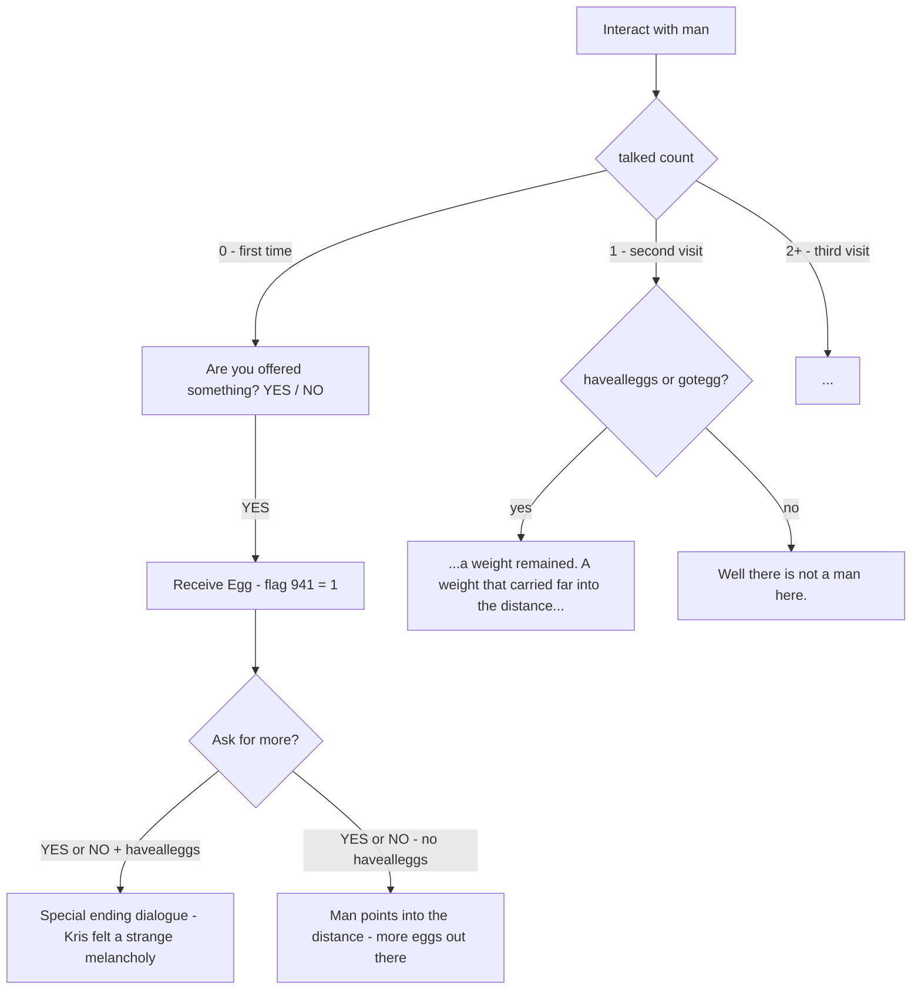

## Flags

| Flag | Description |
|---|---|
| 911 | chapter 1 eggcheck |
| 918 | chapter 2 eggcheck |
| 930 | chapter 3 eggcheck |
| 931 | chapter 4 eggcheck |
| 941 | chapter 5 eggcheck (probably only if you didnt have 4/4 eggs) |
| tempflag[72] | room visit tracker (set to 0.01 on first visit, never 0 again) |

## Room Setup (Create)
```cpp
scr_setparty(0, 0, 0);           // no party members
turnofflayers("REFERENCE");      // hide reference layer
check1 = scr_makenpc_fromasset(findsprite(spr_pxwhite, "REFERENCE", #480AC2));  // the man
check2 = scr_makenpc_fromasset(findsprite(spr_pxwhite, "REFERENCE", #F10E1C));  // behind the tree
scr_musicer("deltarune_piano_collections_by_trevor_alan_gomes.ogg", 1, 1);

if (global.tempflag[72] == 0)
    global.tempflag[72] = 0.01;  // marks first visit
```


## Interaction Flow (check1 - the man)



## havealleggs Condition
```cpp
var havealleggs = false;
if (global.flag[911] && global.flag[918] && global.flag[930] && global.flag[931])
    havealleggs = true;
```
All four egg flags must be set simultaneously.

## check2 - Behind the Tree
```cpp
// Before check1.gone:
"* (He is behind the tree.)"

// After check1.gone:
"* (It is a tree.)"
```


## Notable Details
- `Other_5` is just `exit;` — no async events handled
- `tempflag[72]` uses `0.01` instead of `1` as the visited state, unusual pattern
- The man never speaks directly, all dialogue is Kris's internal observations `(* (...))` 
- The egg sound `snd_egg` plays mid-dialogue when the writer halts
- The "infinite mirrors" description when asking for more eggs without havealleggs is likely intentional lore about the egg locations