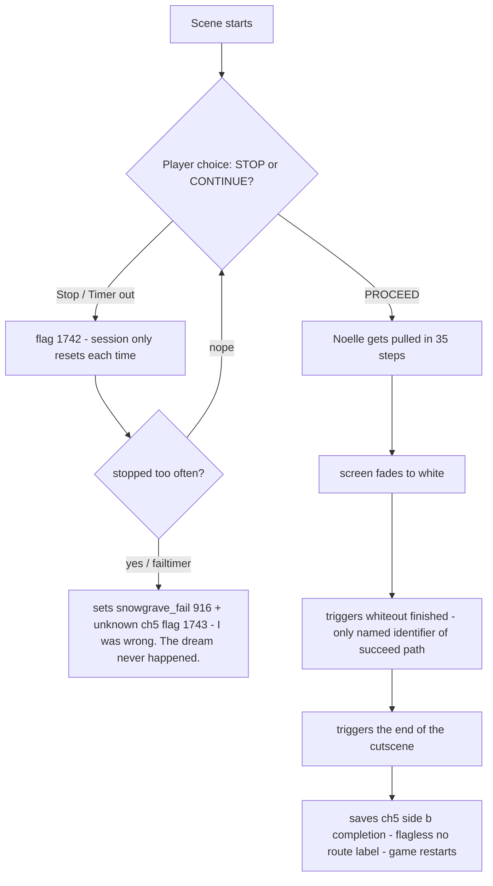

# LW20W Scene Analysis - Deltarune Chapter 5

## Route Structure



## Flags

| Flag | Name               | Description                                                                                      |
| ---- | ------------------ | ------------------------------------------------------------------------------------------------ |
| 915  | **snowgrave_plot** | Progress through snowgrave (0-20)                                                                |
| 916  | **snowgrave_fail** | Set on abort. Reverts practically every effect of the route.                                     |
| 1742 | (unnamed)          | Counts stop attempts within handoff session. Resets to 0 on scene start.                         |
| 1743 | (unknown)          | Set on abort alongside 916. Not in public flag table. Likely ch5-specific weird route fail flag. |

## Abort Path
Both stop paths (early stop and failtimer) set the same flags:
```c
scr_flag_set(1743, 1);
scr_flag_set(916, 1);
scr_litemremove(20);
```
Then: `global.plot = 189` → `room_restart()`

Noelle says: *"I was wrong. The dream never happened."*

## Succeed Path
Completely flagless. The only named identifier of this path is:
```c
if (_opacity >= 1)
{
    _finished = true;
    with (_parent)
        trigger_event("whiteout_finished");
}
```
Then `makeEnd()` → `scr_complete_save_file_b()` → `game_restart_true()`

`scr_complete_save_file_b()` saves ch5 side b completion (consistent with filenames like `filech5_9_b`, `filech4_5_b`).

## Internal Route Name
The sprite layer for the walking sequence is still called `"WEIRD"`:
```c
sinkSpr = findspriteinfo_layer("WEIRD");
```
No rename to "whiteout" on code level.

## Stop Escalation
Flag 1742 picks from `stopActions[]` based on how many times you stopped:
```c
var ind = min(global.flag[1742], array_length(stopActions) - 1);
stopActions[ind]();
global.flag[1742]++;
```
Up to 5 different Noelle responses depending on stop count.

## Files Checked
- `gml_Object_obj_ch5_LW20W_Create_0.gml`
- `gml_Object_obj_ch5_LW20W_Step_0.gml`
- `gml_Object_obj_ch5_LW20W_white_Step_0.gml`
- `gml_Object_obj_ch5_LW20W_nothing_Step_0.gml`
- `gml_Object_obj_ch5_LW20W_handoff_Create_0.gml`
- `gml_Object_obj_ch5_LW20W_handoff_Step_0.gml`
- `gml_Object_obj_ch5_LW20W_handoff_Step_1.gml`
- `gml_Object_obj_ch5_LW20W_handoff_Step_2.gml`
- `gml_Object_obj_ch5_LW20W_end_Create_0.gml`
- `gml_Object_obj_ch5_LW20W_end_Step_0.gml`